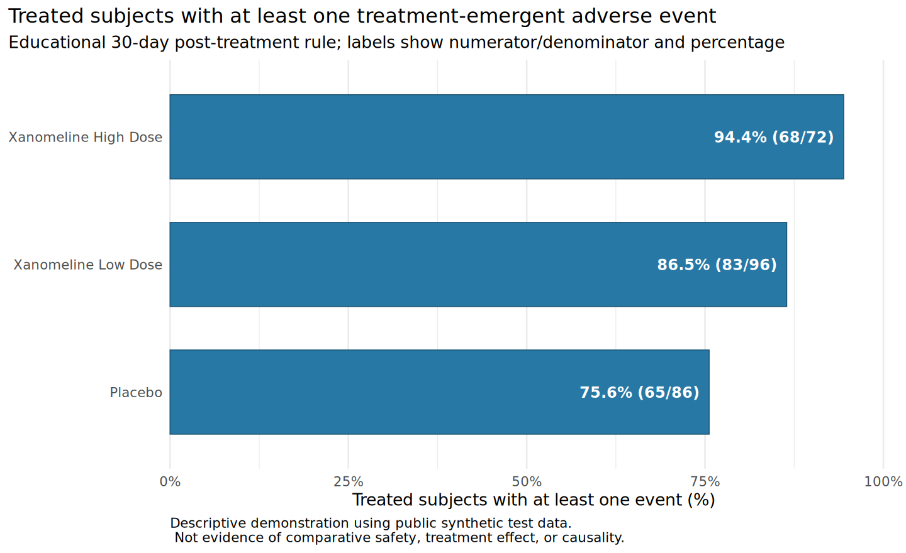

I created this learning demonstrator to make the mechanics of clinical statistical programming inspectable: source data are transformed into small analysis-ready structures, checked programmatically, and carried through to reproducible Tables, Listings, and Figures (TLFs).

The project uses public synthetic standardized clinical-trial test data: the DM, EX, and AE datasets distributed with the [`pharmaversesdtm`](https://pharmaverse.github.io/pharmaversesdtm/) R package. It contains no real patient data and is educational rather than a regulatory submission, validated production system, or claim of formal SDTM or ADaM compliance.

## Source-to-output workflow

1. Load standardized demographics, exposure, and adverse-event domains without modifying the source records.
2. Validate expected datasets, variables, identifiers, keys, date quality, and referential integrity.
3. Derive one subject-level structure and one adverse-event analysis structure using explicit assumptions.
4. Reconcile the analysis data and output numerators and denominators independently.
5. Produce a descriptive subject table, a complete treatment-emergent adverse-event listing, and a treatment-group figure.
6. Publish the report and machine-readable traceability files through a tested GitHub Actions workflow.

{fig-alt="Horizontal bar chart showing 75.6 percent or 65 of 86 placebo subjects, 94.4 percent or 68 of 72 high-dose subjects, and 86.5 percent or 83 of 96 low-dose subjects with at least one event meeting the educational treatment-emergent rule."}

## What the demonstrator emphasizes

- **Standardization:** clear use of DM, EX, and AE concepts while avoiding unsupported compliance claims.
- **Validation:** structured `PASS`, `WARNING`, and `FAIL` checks are visible in both CSV and JSON, and critical failures stop execution.
- **Traceability:** source variables, derivations, analysis variables, and final outputs are linked in human-readable metadata.
- **Reproducibility:** `renv` locks R dependencies, `testthat` covers key logic, Quarto builds the static report, and GitHub Actions reruns and deploys the complete workflow.

The TLF layer is deliberately small. The table summarizes subject characteristics by actual treatment, the listing retains source identifiers and derivation context for every confirmed treatment-emergent event, and the figure shows unique-subject counts with explicit denominators. These are descriptive outputs only; between-group differences do not establish comparative safety, treatment effect, or causality.

## Lessons and limitations

The most important design choice is conservative date handling. Only valid complete `YYYY-MM-DD` values are parsed; partial dates are preserved but never silently imputed. Consequently, some adverse events remain unevaluable rather than being forced to `FALSE`. The treatment-emergent window—first exposure through 30 days after last exposure—is an explicit educational assumption, not a universal regulatory definition.

The repository demonstrates a narrow, reviewable workflow rather than the full complexity, governance, validation, or quality assurance required for production clinical reporting. Its metadata are pragmatic learning artifacts, not Define-XML, and its analysis structures are not formal ADaM datasets.

## Links

- [Live reproducible report](https://miguelcos.github.io/clinical-data-reproducibility-demo/)
- [GitHub repository](https://github.com/MiguelCos/clinical-data-reproducibility-demo)

:::{.tags}
[`R`]{.tag} [`clinical data`]{.tag} [`reproducibility`]{.tag} [`validation`]{.tag}
:::
